<h1 align="center"> RetailPOS </h1>

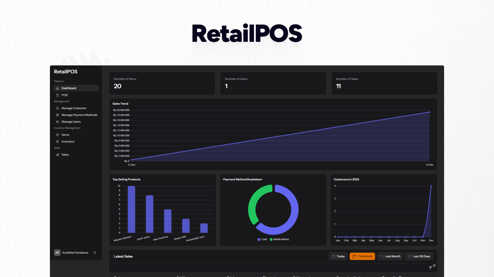

<p align="center">
  A modern Point of Sale application built to help small businesses manage sales, inventory, and customers efficiently.
</p>

## Features

*   **Point of Sale (POS)**: Streamlined checkout interface for quick transactions
*   **Inventory Management**:
    *   Manage Items (Products)
    *   Track real-time Stock Levels
*   **Sales Management**:
    *   Complete Sales History
    *   Printable Receipts
*   **Customer Management**: CRM to track customer details and purchase history
*   **User Management**: Role-based access control (Admins & Staff)
*   **Authentication**: Secure login and Two-Factor Authentication (2FA) support

---

## Tech Stack

[](https://laravel.com)
[](https://filamentphp.com)
[](https://livewire.laravel.com)
[](https://tailwindcss.com)
[](https://www.mysql.com/)

---

## 📸 Screenshots

### Dashboard
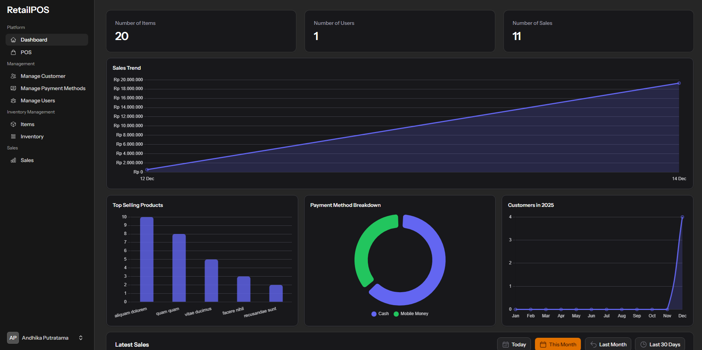
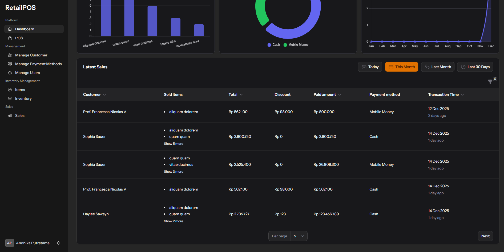

### POS

<table>
  <tr>
    <td align="center">
      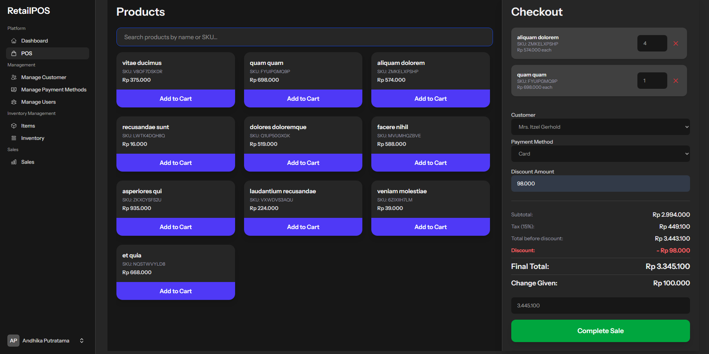
    </td>
  </tr>
</table>


### Customer

<table>
  <tr>
    <td align="center">
      <strong>List Customer</strong><br>
      
    </td>
    <td align="center">
      <strong>Edit Customer</strong><br>
      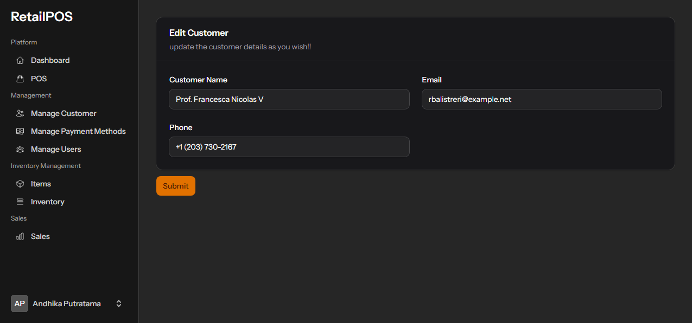
    </td>
  </tr>
</table>

### Payment Method Management

<table>
  <tr>
    <td align="center">
      <strong>List Payment Method</strong><br>
      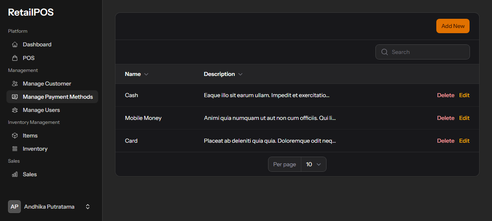
    </td>
    <td align="center">
      <strong>Edit Payment Method</strong><br>
      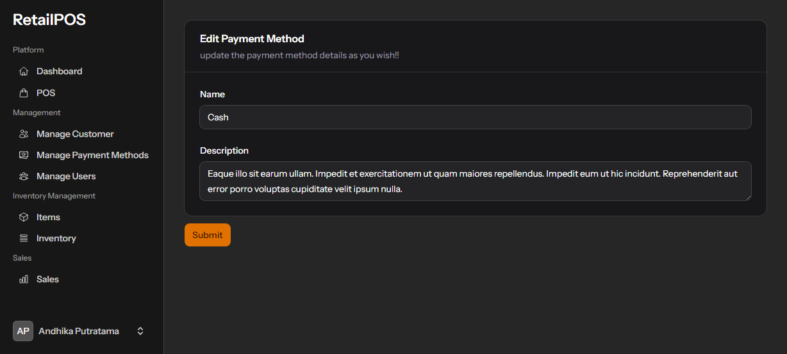
    </td>
  </tr>
</table>

### Users Management

<table>
  <tr>
    <td align="center">
      <strong>List Users</strong><br>
      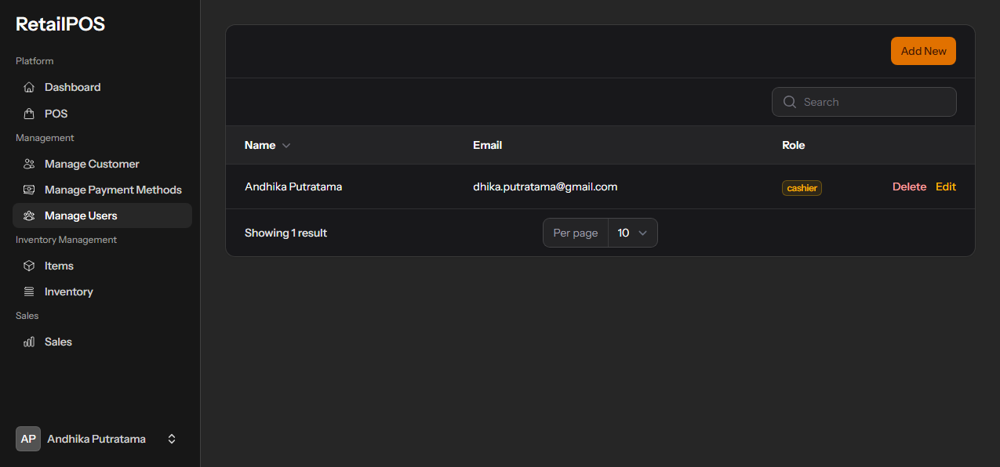
    </td>
    <td align="center">
      <strong>Edit Users</strong><br>
      
    </td>
  </tr>
</table>

### Items Management

<table>
  <tr>
    <td align="center">
      <strong>List Items</strong><br>
      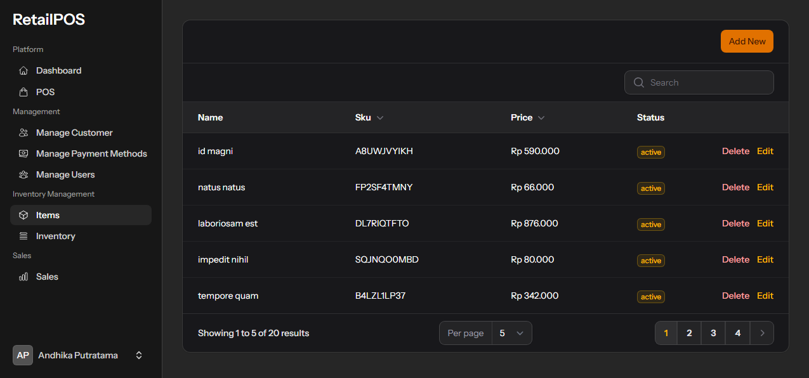
      <>
    </td>
    <td align="center">
      <strong>Edit Items</strong><br>
      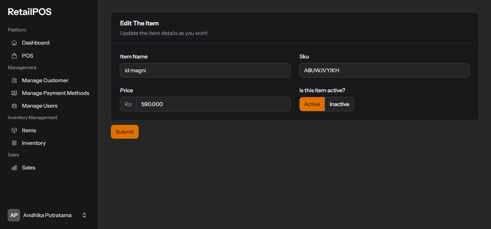
    </td>
  </tr>
</table>


> **Note:**  
> The Items list is paginated with **10 items per page by default**.

### Inventory Management

<table>
  <tr>
    <td align="center">
      <strong>List Inventory</strong><br>
      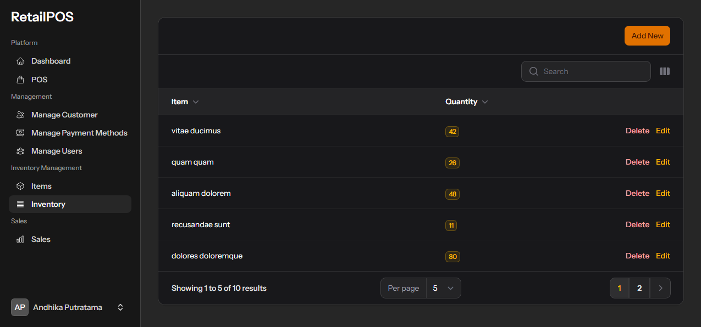
      <>
    </td>
    <td align="center">
      <strong>Edit Inventory</strong><br>
      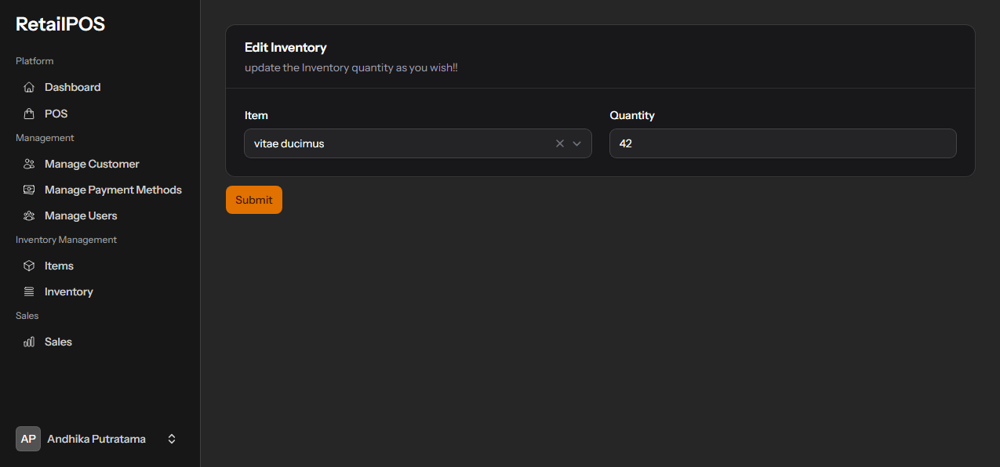
    </td>
  </tr>
</table>


> **Note:**  
> The Inventory list is paginated with **10 items per page by default**.

### Details Sales
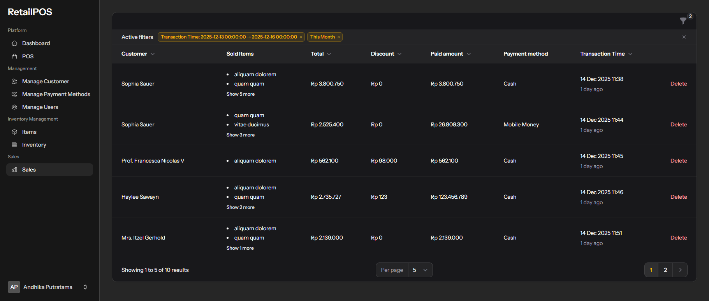

<table>
  <tr>
    <td align="left">
      <strong>Sales Filter</strong><br>
      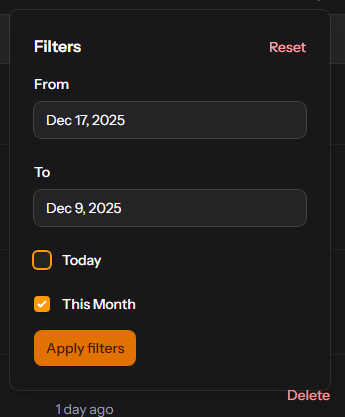
    </td>
  </tr>
</table>

> **Note:**  
> The Sales list is paginated with **10 items per page by default**.

---

## Installation & Setup

### 1. Clone Repository

```bash
git clone https://github.com/yourusername/laravel-pos.git
cd laravel-pos
```

### 2. Install Dependencies

**PHP Dependencies:**
```bash
composer install
```

**Node.js Dependencies:**
```bash
npm install
```

### 3. Environment Setup

```bash
cp .env.example .env
```
Update your `.env` file with your database credentials:
```env
DB_CONNECTION=mysql
DB_HOST=127.0.0.1
DB_PORT=3306
DB_DATABASE=retail_pos
DB_USERNAME=username
DB_PASSWORD=password
```

### 4. Application Setup

**Generate Key:**
```bash
php artisan key:generate
```

**Run Migrations:**
```bash
php artisan migrate
```

### 5. Start Application

**Build Assets:**
```bash
npm run build
```

**Start Server:**
```bash
php artisan serve
```

---

## License

This project is licensed under the **MIT License**.
